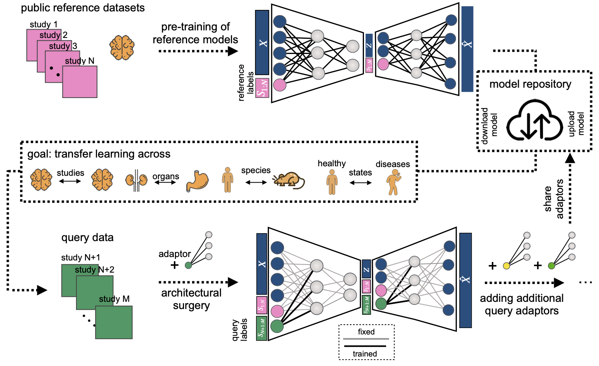

# Revealing cell populations driving resistance in melanoma

## Background & Slide Deck

This demo is based on my targeted single-cell RNA-seq analysis project, which I presented at internal research meetings.
The original study analyzed **clinical trial data** from melanoma patients treated with BRAF inhibitors and integrated it
with public single-cell reference datasets.

The work showcased:
- **Model architecture surgery (scArches / scANVI)** for mapping query datasets onto a reference latent space
- **Differential abundance analysis** using Milo to identify responder-specific microenvironmental changes
- **Pathway and gene-program discovery** with Spectra and Enrichr
- End-to-end **single-cell integration**, annotation, and visualization in a reproducible framework

**Slide Deck**
- [](slides/scArchesPresentation.pdf)
- [scArches Repo](https://github.com/theislab/scarches)

**Contents**
- `data/` (created by script)
- `figures/` (created by script)
- `src/generate_data.py` (makes synthetic counts, metadata, DE, figures)
- `notebooks/` (placeholder for a future notebook)

**Quickstart**
```bash
pip install -r requirements.txt
python src/generate_data.py
```
